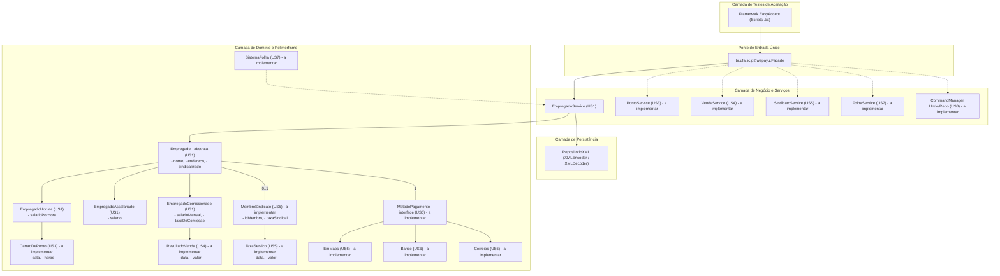

# WePayU - Sistema de Folha de Pagamento

[](https://www.oracle.com/java/)
[](http://easyaccept.sourceforge.net/)
[](https://conventionalcommits.org)
[](https://ic.ufal.br/)

Projeto acadêmico desenvolvido para a disciplina de **Programação 2 (P2) / Programação Orientada a Objetos**, no curso de **Bacharelado em Ciência da Computação** do **Instituto de Computação (IC)** da **Universidade Federal de Alagoas (UFAL)**.

---

## Sumário

- [1. Visão Geral do Sistema](#1-visão-geral-do-sistema)
- [2. Arquitetura e Padrões de Projeto (GoF)](#2-arquitetura-e-padrões-de-projeto-gof)
- [3. Princípios SOLID Aplicados](#3-princípios-solid-aplicados)
- [4. Regras Obrigatórias e Diretrizes de Qualidade](#4-regras-obrigatórias-e-diretrizes-de-qualidade)
- [5. Milestones e User Stories](#5-milestones-e-user-stories)
- [6. Persistência de Dados](#6-persistência-de-dados)
- [7. Padrão de Versionamento (Conventional Commits)](#7-padrão-de-versionamento-conventional-commits)
- [8. Como Executar os Testes](#8-como-executar-os-testes)
- [9. Autoria](#9-autoria)

---

## 1. Visão Geral do Sistema

O **WePayU** é uma implementação do clássico problema de automação de folha de pagamento empresarial, inspirado no estudo de caso de Robert C. Martin (*Agile Software Development: Principles, Patterns, and Practices*).

### Objetivos Principais:
- **Separação Rígida de Camadas**: O sistema concentra-se **exclusivamente na lógica de negócio**, sem interface gráfica com o usuário (GUI). Toda a comunicação externa é realizada através de uma fachada pública orientada a scripts de teste.
- **Conformidade de Requisitos**: Obter **100% de aprovação** nos testes de aceitação automatizados executados pelo framework **EasyAccept**.
- **Modelagem Orientada a Objetos**: Utilização intensiva de polimorfismo, herança semântica, baixo acoplamento e alta coesão.

---

## 2. Arquitetura e Padrões de Projeto (GoF)

A arquitetura do sistema foi desenhada em camadas claras e desacopladas, garantindo que regras de negócio, modelos de domínio e persistência não se misturem:



### Padrões de Projeto Empregados:

1. **Façade (Fachada)**:
   - Implementado na classe [`br.ufal.ic.p2.wepayu.Facade`](WePayU/src/br/ufal/ic/p2/wepayu/Facade.java).
   - Centraliza e simplifica a invocação de todas as operações do sistema para o EasyAccept, orquestrando as chamadas aos serviços de negócio subjacentes sem expor as complexidades internas.
2. **Strategy (Estratégia)**:
   - **Métodos de Pagamento**: Interface `MetodoPagamento` com implementações polimórficas (`Correios`, `EmMaos`, `DepositoBanco`).
   - **Cálculo Salarial e Vencimentos**: Cada tipo de empregado (`Horista`, `Assalariado`, `Comissionado`) implementa seu próprio cálculo de proventos e horas extras.
3. **Command & Memento (Comandos e Transações)**:
   - Aplicado para suportar a **User Story 8 (Undo/Redo)**.
   - Cada operação mutável (US 1 a US 7) é encapsulada em um objeto comando reversível, mantendo uma pilha histórica de execução e permitindo desfazer (`undo`) e refazer (`redo`) alterações no estado do sistema.
4. **Factory Method (Fábrica)**:
   - Criação desacoplada de instâncias de empregados, agendas e métodos de pagamento a partir dos parâmetros fornecidos pelos scripts.

---

## 3. Princípios SOLID Aplicados

- **S - Single Responsibility Principle (SRP)**:
  - Cada classe possui uma única responsabilidade no sistema. Ex.: A classe `Empregado` não calcula taxas de serviço do sindicato nem salva a si mesma em disco; tais responsabilidades cabem a `SindicatoService` e `RepositorioXML`.
- **O - Open/Closed Principle (OCP)**:
  - O sistema é extensível para novos tipos de empregados, novas agendas de pagamento ou novos métodos de entrega sem necessidade de modificar a lógica de folha de pagamento existente.
- **L - Liskov Substitution Principle (LSP)**:
  - Qualquer subtipo de `Empregado` pode ser substituído por sua classe base abstrata sem comprometer a exatidão das rotinas do sistema.
- **I - Interface Segregation Principle (ISP)**:
  - Interfaces enxutas e focadas. Classes não são forçadas a implementar contratos dos quais não necessitam.
- **D - Dependency Inversion Principle (DIP)**:
  - Módulos de alto nível não dependem de módulos de baixo nível diretamente; ambos dependem de abstrações e interfaces.

---

## 4. Regras Obrigatórias e Diretrizes de Qualidade

> [!CAUTION]
> As seguintes regras são **obrigatórias e rigorosamente avaliadas** pelos monitores e professor da disciplina:

| Regra | Diretriz de Implementação | Motivação Teórica (POO / Clean Code) |
|---|---|---|
| **Proibido o uso de `instanceof`** | O operador `instanceof` e checagens por reflexão (`getClass() == ...`) são **terminantemente proibidos**. | Viola o polimorfismo e o princípio Aberto/Fechado (OCP). A variação de comportamento deve ser disparada por dispatch polimórfico dinâmico. |
| **Proibido lançar Exceções Genéricas** | Proibido o uso de `throw new Exception()` ou `throw new RuntimeException()`. | Toda condição excepcional de negócio deve possuir sua classe de exceção personalizada, contendo a mensagem canônica exata requerida pelo EasyAccept. |
| **Princípio DRY (Don't Repeat Yourself)** | Proibido repetir blocos de código redundantes. | Lógicas de validação de datas, strings nulas/vazias e cálculos recorrentes devem ser extraídas para utilitários ou métodos abstratos comuns. |
| **Herança Semântica Correta** | Subclasses devem realmente estender características conceituais da superclasse. | Evita subclasses impuras ou herança por conveniência; assegura o cumprimento do princípio de Liskov (LSP). |
| **Foco em Polimorfismo** | Delegação de comportamentos variantes aos próprios objetos responsáveis. | Substitui estruturas de decisão em cascata (`switch/case`, `if/else` encadeados sobre tipos de empregados). |

---

## 5. Milestones e User Stories

O desenvolvimento é incremental, dividido em iterações avaliativas:

### Milestone 1 (User Stories 1 a 8)
- [ ] **US1**: Adição de Empregados (Horista, Assalariado, Comissionado)
- [ ] **US2**: Remoção de Empregados
- [ ] **US3**: Lançamento de Cartão de Ponto (horas normais e horas extras a 1.5x)
- [ ] **US4**: Lançamento de Resultado de Vendas (comissões)
- [ ] **US5**: Lançamento de Taxa de Serviço Sindical
- [ ] **US6**: Alteração de Detalhes do Empregado (dados cadastrais, filiação ao sindicato, método de pagamento)
- [ ] **US7**: Rodar a Folha de Pagamento para o dia indicado
- [ ] **US8**: Sistema de Transações Undo/Redo

### Milestone 2 (User Stories 9 e 10)
- [ ] **US9**: Agendas de Pagamento padrão (`semanalmente`, `mensalmente`, `bi-semanalmente`)
- [ ] **US10**: Criação de novas Agendas de Pagamento customizadas pela direção da empresa

---

## 6. Persistência de Dados

Conforme especificado, o projeto não utiliza bancos de dados relacionais convencionais.
- A persistência do estado do sistema entre execuções é implementada através de serialização em arquivos **XML**.
- Tecnologias padrão da biblioteca Java:
  - `java.beans.XMLEncoder` para escrita do grafo de objetos.
  - `java.beans.XMLDecoder` para leitura e recuperação do estado dos dados.
- O sistema fornece comandos de `zerarSistema` e `encerrarSistema` para gerenciar a persistência durante os testes automatizados.

---

## 7. Padrão de Versionamento (Conventional Commits)

O projeto adota a convenção padronizada de mensagens de commit baseada no [Conventional Commits](https://www.conventionalcommits.org/pt-br/v1.0.0/):

```text
<tipo>(<escopo>): <descrição no imperativo e em minúsculas>

[corpo opcional detalhando a motivação da alteração]
```

### Diretriz de Commits Atômicos (Modulares)

Para manter o histórico do Git limpo, rastreável e facilitar o *code review*, o projeto adota **commits atômicos e granulares por camada**. Cada commit deve conter apenas arquivos de uma responsabilidade específica:

- `feat(exceptions)`: Exceções personalizadas de negócio da User Story.
- `feat(models)`: Modelos conceituais e polimórficos de domínio.
- `feat(utils)`: Formatadores e utilitários auxiliares.
- `feat(persistence)`: Mecanismos de gravação e restauração em disco (XML).
- `feat(services)`: Serviços de orquestração de negócio e fábricas (Factory Method).
- `feat(facade)`: Exposição de métodos públicos na Façade para o EasyAccept.
- `docs(...)`: Documentações e diagramas arquiteturais.

---

## 8. Como Executar os Testes e Validação de Qualidade

O projeto utiliza o framework **EasyAccept** (presente no diretório [`WePayU/lib/easyaccept.jar`](WePayU/lib/easyaccept.jar)) para testes de aceitação e a própria ferramenta de análise estática do compilador Java para garantia de qualidade de código.

### 8.1 Verificação de Qualidade e Linter (Compilação Estrita)
Para assegurar a conformidade com as regras de Clean Code (sem advertências de serialização, casts inseguros, tipos brutos ou recursos não fechados), o código-fonte é validado pelo analisador estático do Java com a flag `-Xlint:all`:

```powershell
# Na pasta WePayU, executando o linter estrito:
javac -Xlint:all -cp "lib/easyaccept.jar;src" -d out (Get-ChildItem -Path "src" -Filter "*.java" -Recurse | Select-Object -ExpandProperty FullName)
```
> **Critério de Aceitação de Código**: Compilação limpa com **0 erros e 0 warnings**.

### 8.2 Execução dos Testes EasyAccept via Linha de Comando
Na pasta [`WePayU`](WePayU/):

```powershell
# Executando a suite da US1:
java -cp "lib/easyaccept.jar;out;." Main us1 us1_1
```

### 8.3 Execução via IntelliJ IDEA
1. Abra o projeto pela pasta [`WePayU`](WePayU/).
2. Certifique-se de que a biblioteca `easyaccept.jar` está configurada como dependência do módulo.
3. Abra a classe [`WePayU/src/Main.java`](WePayU/src/Main.java).
4. Descomente a linha do script de teste que deseja executar (ex.: `EasyAccept.main(new String[]{facade, "tests/us1.txt"});`).
5. Execute o método `main`.


---

## 9. Autoria

Desenvolvido por **Anna Beatriz Bernado Gomes** ([@nanameetscode](https://github.com/nanameetscode)).

Instituto de Computação (IC) — **Universidade Federal de Alagoas (UFAL)**.