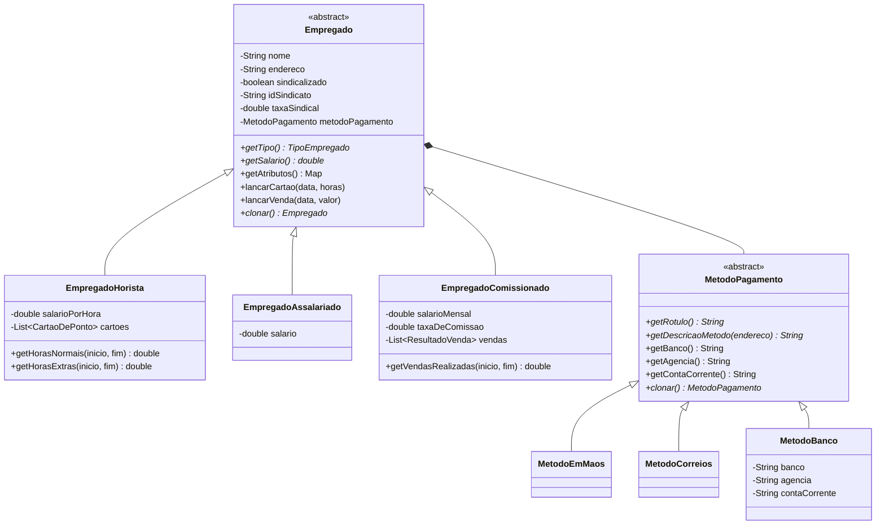

# Camada de Domínio (`models`)

Este pacote concentra as **entidades centrais de negócio** e os **objetos de valor** do WePayU, estruturados sob rigorosos princípios de Programação Orientada a Objetos (POO), Clean Code e padrões de projeto GoF.

---

## 1. Visão Geral da Arquitetura de Domínio

O domínio foi desenhado para eliminar completamente acoplamentos desnecessários e estruturas condicionais que violem os princípios SOLID. Toda a variabilidade de regras salariais, lançamentos e recebimentos é resolvida através de **polimorfismo dinâmico**, sem o uso do operador `instanceof` ou de reflexão.

---

## 2. Padrões de Projeto Aplicados

### A. Polimorfismo Puro e Substituição de Liskov (LSP)
- **Eliminação de `instanceof`**: Em vez de inspecionar tipos em blocos `if/else`, a classe base [`Empregado`](./Empregado.java) define contratos protegidos e comportamentos padrão (como lançar exceções semânticas como `EmpregadoNaoEhHoristaException` ou `EmpregadoNaoEhComissionadoException`).
- **Especialização Semântica**:
  - [`EmpregadoHorista`](./EmpregadoHorista.java) sobrescreve métodos de lançamento e cálculo de cartões de ponto com horas extras a 1.5x.
  - [`EmpregadoAssalariado`](./EmpregadoAssalariado.java) encapsula o salário contratual fixo.
  - [`EmpregadoComissionado`](./EmpregadoComissionado.java) estende o mapa de atributos para expor comissão e gerencia os resultados de vendas.

### B. Strategy Pattern (GoF) — [`MetodoPagamento`](./MetodoPagamento.java)
- Encapsula polimorficamente o mecanismo de remuneração do colaborador:
  - [`MetodoEmMaos`](./MetodoEmMaos.java): Entrega em mãos por cheque.
  - [`MetodoCorreios`](./MetodoCorreios.java): Envio postal para o endereço cadastral.
  - [`MetodoBanco`](./MetodoBanco.java): Depósito em conta bancária (contendo banco, agência e conta corrente).
- **Sem checagens de tipo**: Acesso aos atributos bancários via delegação. Se o método não for depósito em conta, a classe base abstrata lança automaticamente `EmpregadoNaoRecebeEmBancoException`.

### C. Memento / Prototype Pattern (GoF) — [`SistemaSnapshot`](./SistemaSnapshot.java)
- Utilizado para o suporte transacional de **Undo / Redo (US8)**.
- O snapshot retém uma cópia profunda do grafo de objetos de empregados através do método polimórfico `clonar()`. Isso assegura que reverter um estado não sofra efeitos colaterais de referências compartilhadas em coleções (`cartoes`, `vendas`, `taxasServico`).

---

## 3. Registros de Apoio e Entidades de Ligação

- [`CartaoDePonto`](./CartaoDePonto.java): Armazena data e total de horas diárias trabalhadas, fornecendo polimorficamente a partição entre até 8h normais e excedente extra.
- [`ResultadoVenda`](./ResultadoVenda.java): Registra a data e o montante financeiro da venda realizada pelo comissionado.
- [`TaxaServico`](./TaxaServico.java): Representa cobranças sindicais extraordinárias, incluindo controle do flag `cobrada` para desconto apenas quando houver saldo líquido suficiente.

---

## 4. Conformidade JavaBeans e Persistência XML

Todas as classes do pacote são compatíveis com `java.beans.XMLEncoder` e `java.beans.XMLDecoder`:
- Construtores sem argumentos (`public DefaultConstructor()`).
- Getters e setters padronizados conforme especificação JavaBeans.
- Metadados `@ConstructorProperties` onde construtores de inicialização rápida são requeridos.
