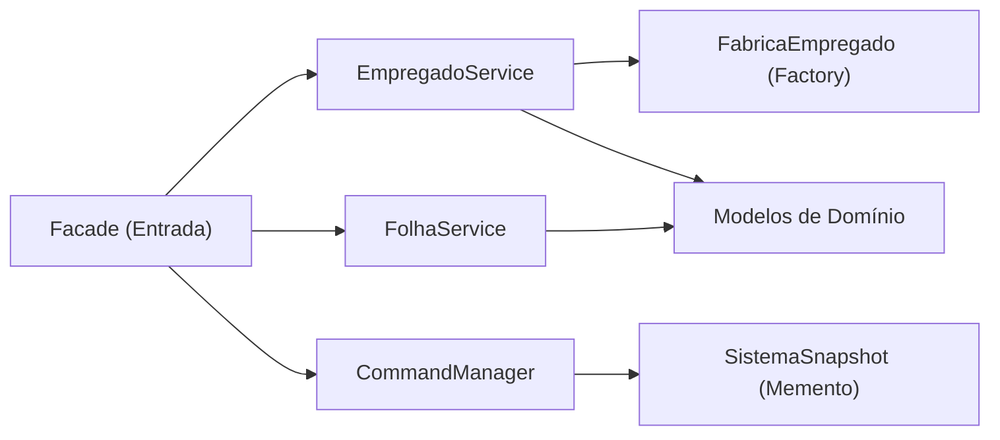

# Camada de Serviços e Negócio (`services`)

Este pacote concentra a **lógica de aplicação**, **orquestração de transações** e **regras de folha de pagamento** do WePayU, implementando princípios SOLID e padrões de projeto GoF.

---

## 1. Visão Geral da Camada de Serviços

A camada de serviços atua como mediadora entre a fachada pública do sistema ([`Facade`](../Facade.java)) e as entidades de domínio ([`models`](../models/)):

---

## 2. Componentes e Padrões GoF Aplicados

### A. Factory Method (GoF) — [`FabricaEmpregado`](./FabricaEmpregado.java)
- Isola completamente a responsabilidade de instanciar as subclasses concretas de `Empregado`.
- Permite que o [`EmpregadoService`](./EmpregadoService.java) receba dados brutos validados e delegue a criação do tipo adequado sem expor detalhes de construtores ao restante da aplicação.

### B. Command Pattern (GoF) — [`CommandManager`](./CommandManager.java)
- Responsável pelo ciclo de vida transacional de **Undo / Redo (US8)**.
- **Funcionamento**:
  - Mantém duas pilhas independentes: `undoStack` e `redoStack`.
  - Cada operação mutante (criar, remover, alterar, lançar cartão, lançar venda, lançar taxa, rodar folha ou zerar sistema) registra um par de estados (`antes` e `depois`) capturados via Memento ([`SistemaSnapshot`](../models/SistemaSnapshot.java)).
  - Ao registrar um novo comando, a pilha de redo é automaticamente esvaziada.
  - Se um comando lançar uma exceção de validação (ex: `DataInvalidaException`), a transação é abortada e nada é empilhado no histórico.
  - Bloqueia comandos após o encerramento do sistema (`ComandoDepoisDeEncerrarException`).

### C. Serviço de Folha de Pagamento — [`FolhaService`](./FolhaService.java)
- Centraliza as regras de cálculo e emissão de folhas de pagamento (**US7**):
  - **Horistas**: Pagos semanalmente a cada sexta-feira, considerando a semana anterior `[data - 6 dias, data]`. Aplica adicional de 50% em horas extras. Deduz 7 dias de taxa sindical e taxas de serviço pendentes. Débitos que superem o salário bruto acumulam em `debitoSindicalAcumulado` para o próximo período.
  - **Comissionados**: Pagos a cada duas semanas às sextas-feiras (com marco inicial em `14/01/2005`). Salário fixo proporcional (`salario * 24 / 52`) e comissão de vendas calculados com truncamento em 2 casas decimais. Deduz 14 dias de taxa sindical.
  - **Assalariados**: Pagos no último dia do mês corrente (`data.lengthOfMonth()`). Salário bruto integral e dedução da taxa sindical pelos dias do mês.
  - **Geração de Relatórios**: Emissão de arquivo de texto com alinhamento rigoroso de colunas (127 caracteres) e terminação de linha CRLF compatível com os arquivos de referência.

### D. Gestão de Cadastro — [`EmpregadoService`](./EmpregadoService.java)
- Gerencia o ciclo de vida e a integridade cadastral:
  - Validação estrita de entradas textuais (nulos, vazios, formatos numéricos e valores não negativos).
  - Alocação sequencial de identificadores de empregados (`ultimoId`).
  - Associação e desassociação com sindicato e taxas de serviço.
  - Gerenciamento de cartões de ponto e relatórios de período semiaberto `[dataInicial, dataFinal]`.
